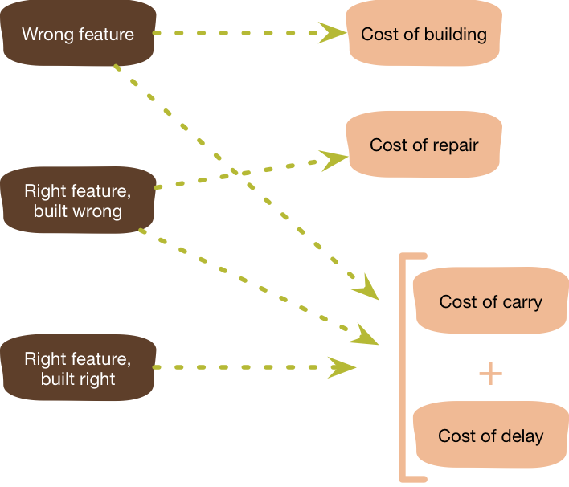

Yagni最初是一个缩写，代表“你将不需要它”。这是极限编程的口头禅，通常在敏捷软件团队中使用。有一种说法认为，我们现在不应构建某些将来“可能需要的“软件功能，因为最终你会发现“你将不需要它”。

Yagni是一种引用极限编程的简单设计实践。（从《白皮书》一版出现，第二版引用了“增量设计”的相关概念）。与极限编程的许多元素一样，它与90年代后期普遍认可的软件工程原理形成鲜明对比，当时的软件开发过程以强瀑布式模型为首，全面仔细的预定设计方案由一批经验丰富的工程师们大力推动。

想象以下，我在与一家初创公司合作，为航运业务销售保险。他们的软件系统分为两个主要部分：一个用于定价，一个用于销售。这样的依赖关系使得他们在定价软件完成之前无法有效的开展销售软件的开发。

目前，该团队正在努力更新定价部分，以增加对暴风雨风险类保险的支持。他们知道，在六个月的时间内，他们还将需要支持海盗劫持保险的定价。由于他们目前正在开发定价系统，因此他们考虑立刻为海盗劫持保险增加功能，这样，定价服务将在销售软件可以使用前就已经完成。

Yagni对此表示反对，它说，由于六个月内不需要为假设的海盗劫持保险定价，因此除非有必要，否则不应该开发海盗劫持保险定价功能。因此如果开发定价软件需要两个月的时间，那么就不应该在花费额外四个月。这四个月应作为计划风险的缓冲时间并更新销售组件。

Yagni的第一个论据是，尽管我们现在可能认为我们需要此功能，但很可能我们错了。毕竟，为了保持敏捷，我们随时接受不断变化的需求。由计划驱动的需求专家可能会大力反驳说：这是因为我们没有对需求分析作足够多的工作，我们应该花更多的时间与精力在计划上。我通过指出需要**提前确定需求**的**难度**与**成本**来反驳这一观点。因为一旦海军消灭了海盗，整个商业模式将不复存在。

在这种情况下，开发假设功能的成本很明显，**开发成本**：分析，编成，测试此无用的功能所花费的全部精力。

那如果我们对需求的判断是完全正确的，海军没有消灭海盗。即使在这种顺利的情况下，开发假设功能也会招来两个严重的代价。第一个成本是延迟价值的成本。因为我们花了大量时间用于开发海盗劫持的保险定价功能，导致我们没有时间开发其他功能。如果我们将时间投入到开发针对天气风险的销售软件中去，则可以将完整的暴风雨风险保险销售功能投入使用，并在短短两个月内产生营收。假设的海盗劫持保险功能开发导致的**延迟成本**等价于暴风雨保险销售产生的整整两个月的业务营收。

人们开发假设功能的常见原因是因为他们觉得现在开发要比以后开发更容易。但是，当你把延迟成本考虑在内，再把假设功能取消的概率考虑在内，你会发现这么做并不核算。

通常，人们不会将现在开发与将来开发的成本作对比。在指导开发人员时，常用的一种方法是让他们**想象**，如果以后需要对功能进行**重构**引入该功能通常需要花费多长时间。这种思考实验足以说服他们，以后再增加这个功能时，并不会花费太多时间。这种想象产生的另一种效果是增加了一些现在看起来很容易做到的事情，但大大降低了后期的成本。比如通过查找表来表示错误信息，而非把文字内联在代码当中。或一开始就使用日志打印过程，而非到最后需要全面增加日志功能等。

**延迟成本**只是假设功能的成本之一，而另一种成本则是**携带成本**。假设功能的代码给软件增加了复杂度，这种复杂度会使理解、修改和调试软件变得更加困难，从而增加了开发其他功能的成本。如果为海盗劫持保险定价增加功能，则会带来额外的复杂度，使得开发暴风雨保险销售组件需要额外的两周时间。这两周时间包含了开发功能额外成本与投入使用的额外延迟成本。并且更糟的是你得维护、测试、调试这个看起来不需要的功能。如果未来我们不需要这个海盗劫持保险的定价功能了，你还得承担全面清理它的成本（这可能比你开发它还要来的多）。

开发团队一直在学习有关用户需求和代码的信息。他们所使用的功能会定期升级。他们还将了解代码是如何一起工作的。所有这些意味着后续的技术债务成本。

那既然有开发的概率，但目前开发成本太大，我们是否能预留一些接口以支持未来的灵活性呢？Yagni说大可不必，因为你可能甚至不需要其他定价功能，或者你现在对所学到的知识是不完全的，甚至是部分错误的。所以任何你尚未完全理解的需求的接口抽象都将导致代码的难以理解，抽象接口的改变导致的修改成本将更为巨大。

Yagni的建议是：作为一个开发人员，很容易花一个小时来添加一个我们确定需要的抽象接口，但在一个小时内难以消除一个坏的抽象所产生的错误影响。许多小的Yagni决策加起来大大降低了代码库的复杂度，同时加快了急需的功能的交付。

我们已经了解了 Yagni的重要，现在我们来聊一下它的局限性。**Yagni只适用于决策假设功能的开发，而不适用于使软件更易于维护的工作**。在重构上花费更多的精力是非常必要的，因为重构使代码更具有延展性。当你对需求与代码的理解已经达到了重构的临界点，请务必不要再恪守 Yagni。**Yagni只适用于不那么迫切的假设功能上**。

Yagni在**进化设计**时起到重要的作用，其思想类似于**需求驱动开发**，为了适应不断变化的外界环境，软件需要持续进化出有用的特性来，而那些尚未到来的需求，先采用Yagni忽略他们吧，总体来说Yagni很容易成功。